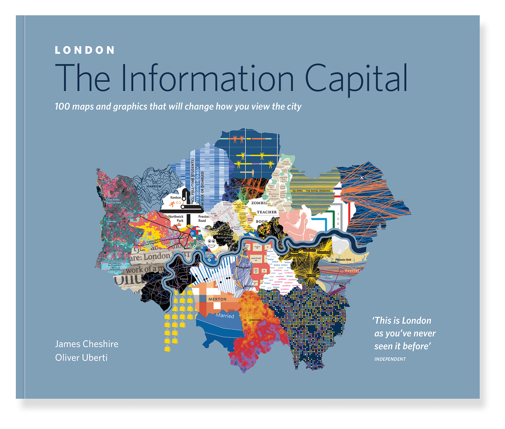
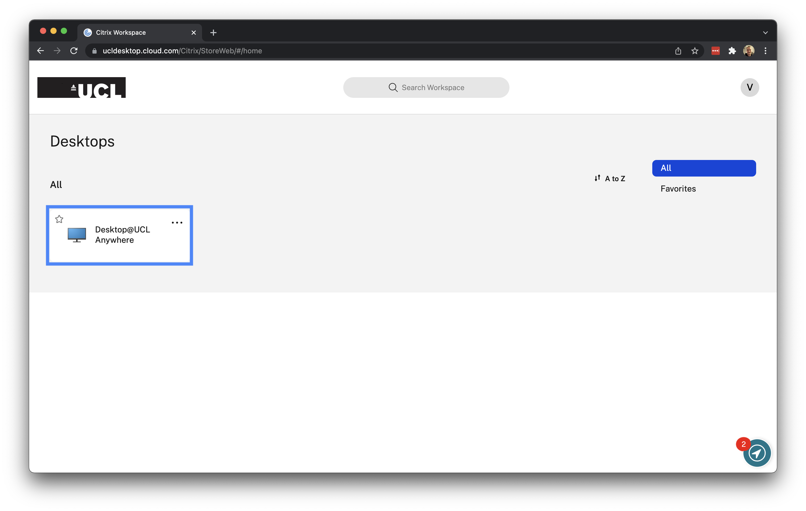
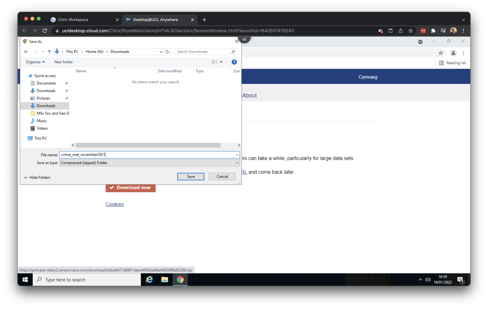
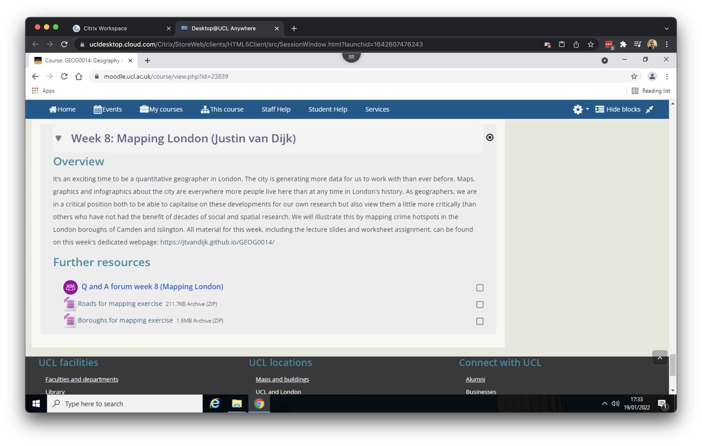
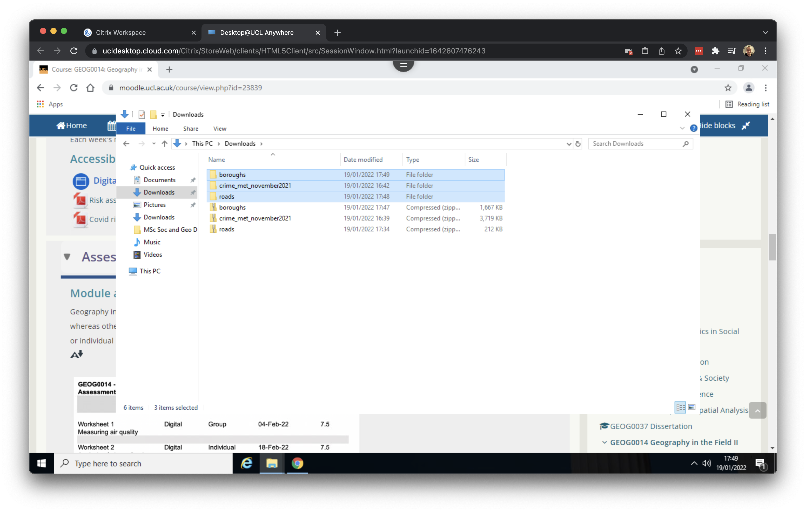
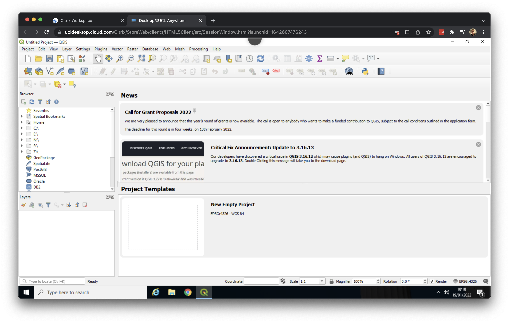
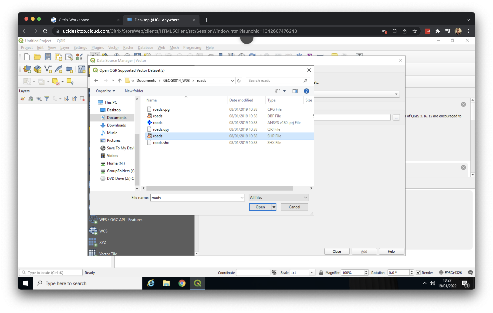
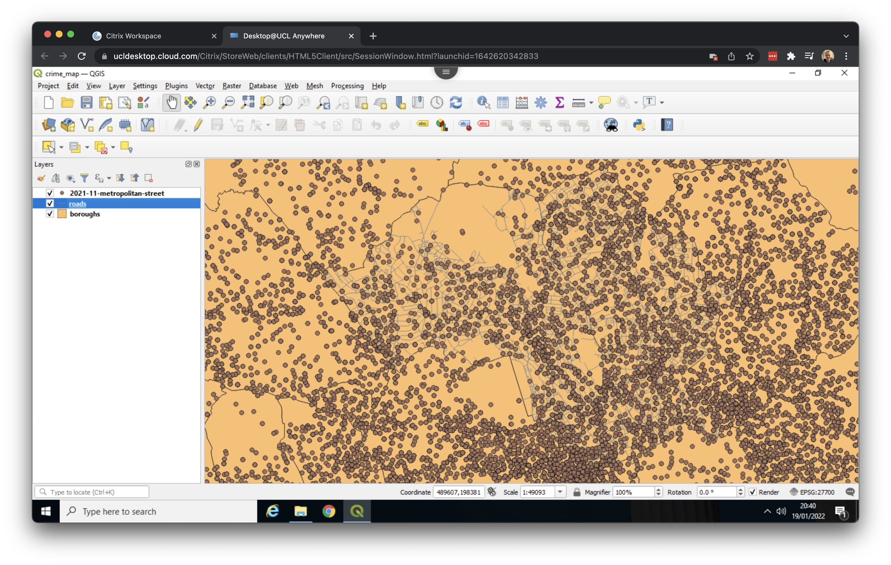
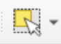
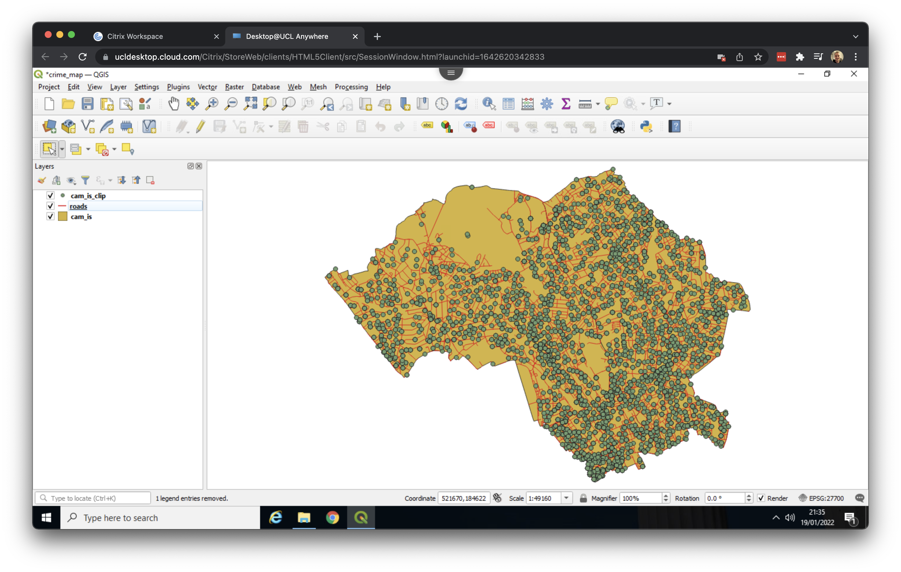

--- 
title: "Geography in the Field II: Mapping London"
author: Week 08 by [Justin van Dijk](https://mappingdutchman.com/)
date: "Last modified: `r Sys.Date()`"
site: bookdown::bookdown_site
output: bookdown::gitbook
documentclass: book
link-citations: yes
github-repo: "jtvandijk/GEOG0014"
description: "GEOG0014: Geography in the Field II."
url: 'https\://jtvandijk.github.io/GEOG0014/'
---

#  {-}

## Why London? {-}
It is an exciting time to be a quantitative geographer in London. The city is generating more data for us to work with than ever before. Maps, graphics and infographics about the city are everywhere more people live here than at any time in London’s history. A great example of the variety of data that is available for London is captured in the book [London: The Information Capital](https://www.oliveruberti.com/the-information-capital) by [James Cheshire](https://jcheshire.com/) and [Oliver Uberti](https://www.oliveruberti.com/). As geographers, we are in a critical position both to be able to capitalise on these developments for our own research but also view them a little more critically than others who have not had the benefit of decades of social and spatial research.

```{r london-information-capital, echo=FALSE, fig.align='center', out.width='500pt', fig.cap='London: The Information Capital by Professor [James Cheshire](https://jcheshire.com/) and [Oliver Uberti](https://www.oliveruberti.com/the-information-capital).'}

```

The application of quantitative research methods to data about the "real-world" is at the heart of this exercise. All data are collected at a single point in time and so may become out of date, or they may be too generalised to capture the minutiae of an area. Such limitations are not as significant as they once were since we now have access to data in more detail than ever before, but this does not relinquish the need to get a sense for the broader context of the study area. 

## Lecture material {-}
You can access the Lecturecast recording here: [[Link]](https://echo360.org.uk/section/499636bf-4a88-4c90-a268-ba74bd9ef17d/home). The slides for this week's lecture can be downloaded here: [[Link]](https://github.com/jtvandijk/GEOG0030/tree/master/data/ppt/w08_gif.pdf).

## This week {-}
This week we will be mapping **crime hotspots** in the London boroughs of [Camden](https://www.google.com/maps/place/London+Borough+of+Camden,+London/@51.5428102,-0.1944449,13z/data=!3m1!4b1!4m5!3m4!1s0x48761aec186b9a3d:0x41185c626be66e0!8m2!3d51.5454736!4d-0.1627902?hl=en) and [Islington](https://www.google.com/maps/place/London+Borough+of+Islington,+London/@51.5470193,-0.1444663,13z/data=!3m1!4b1!4m5!3m4!1s0x48761b5dedeb3be5:0x54f085cb18ec65c9!8m2!3d51.5465063!4d-0.1058058?hl=en). The data we will be working with for this week's task are downloaded from the [data.police.uk](https://data.police.uk/) website. The release of official police crime data to the public was controversial at the time, with some people expressing concern that areas will have reputational damage, that the identities of victims would be revealed and that there would be social and economic consequences such as a fall in house prices in high crime areas. Others argued that the release of the data would be an important step in making the police force more accountable since the public could track whether crimes were being solved or if police are using their stop and search powers to target specific groups. 

:::note
**Note** <br />
You are expected to work through the following computer tutorial on your own, however, you need to submit your worksheet for this week as a group.
:::

## Getting started {-}
Some of you may already have played around with some GIS software such as [ArcGIS](https://www.arcgis.com/index.html), but today we will be using the open-source GIS sofware suite [QGIS](https://www.qgis.org/en/site/). A copy of [QGIS](https://www.qgis.org/en/site/) comes pre-installed on all cluster room computers as well as on [Desktop@UCL Anywhere](https://www.ucl.ac.uk/isd/services/computers/remote-access/desktopucl-anywhere). Desktop@UCL Anywhere is a service that allows remote access to UCL resources for staff and students. All you need is a valid UCL user ID and password, an internet connection and supported web browser. Today we will be using this Desktop@UCL Anywhere service. 

Let's get started by opening an internet browser such as [Google Chrome](https://www.google.co.uk/chrome/?brand=FHFK&gclid=Cj0KCQiAip-PBhDVARIsAPP2xc26lB3ONziz2KnCd7Ac1MVjTx66n0Ull4R8oiQqzXzgKnJSqRCwK60aAhmFEALw_wcB&gclsrc=aw.ds) or [Microsoft Edge](https://www.microsoft.com/en-us/edge) and navigating to: [https://ucldesktop.cloud.com](https://ucldesktop.cloud.com).

```{r ucl-desktop-login, echo=FALSE, fig.align='center', out.width='850pt', fig.cap='[Desktop@UCL Anywhere]((https://ucldesktop.cloud.com)) login interface. [[Enlarge image]](https://jtvandijk.github.io/GEOG0014/images/w08/ucl_login.png){target="_blank"}'}
knitr::include_graphics('images/w08/ucl_login.png')
```

You can log in with your normal **UCL username** and **UCL password**. After this, you click on the Desktop@UCL Anywhere icon to start the service:

```{r ucl-desktop-start, echo=FALSE, fig.align='center', out.width='850pt', fig.cap='Starting [Desktop@UCL Anywhere]((https://ucldesktop.cloud.com)). [[Enlarge image]](https://jtvandijk.github.io/GEOG0014/images/w08/ucl_start.png){target="_blank"}'}

```

It may take a few minutes to load, but after this you should see your normal UCL Windows desktop:

```{r ucl-desktop-login-success, echo=FALSE, fig.align='center', out.width='850pt', fig.cap='Your [Desktop@UCL Anywhere]((https://ucldesktop.cloud.com)). [[Enlarge image]](https://jtvandijk.github.io/GEOG0014/images/w08/ucl_login_success.png){target="_blank"}'}
knitr::include_graphics('images/w08/ucl_login_success.png')
```

## Downloading crime data {-}
For our crime data, we will use data directly from the Police Data Portal, which you can find at [data.police.uk](https://data.police.uk/). This Data Portal allows you to access and generate tabular data for crime recorded in the U.K. across different the different police forces. In total, there are 45 territorial police forces (TPF) and 3 special police forces (SPF) of the United Kingdom. Each TPF covers a specific area in the UK (e.g. the "West Midlands Police Force"), whilst the SPFs are cross-jurisdiction and cover specific types of crime, such as the British Transport Police. Therefore, when we want to download data for a specific area, we need to know which Police Force covers the Area of Interest (AOI) for our investigation.

When you look to download crime data for London, for example, there are two territorial police forces working within the city and its greater metropolitan area:

- *The Metropolitan Police Force*, which covers nearly the entire London area, including Greater London
- *The City of London Police*, which covers the City of London. The Met has no jurisdiction in the Cit of London.

Today we will leave the City of London for what it is as we are looking at **crime hotspots** in the London boroughs of [Camden](https://www.google.com/maps/place/London+Borough+of+Camden,+London/@51.5428102,-0.1944449,13z/data=!3m1!4b1!4m5!3m4!1s0x48761aec186b9a3d:0x41185c626be66e0!8m2!3d51.5454736!4d-0.1627902?hl=en) and [Islington](https://www.google.com/maps/place/London+Borough+of+Islington,+London/@51.5470193,-0.1444663,13z/data=!3m1!4b1!4m5!3m4!1s0x48761b5dedeb3be5:0x54f085cb18ec65c9!8m2!3d51.5465063!4d-0.1058058?hl=en), both of which are not part of the City of London. To do this, open Google Chrome (**within** your Desktop@UCL environment) and navigate to [data.police.uk](https://data.police.uk/).

```{r data-police, echo=FALSE, fig.align='center', out.width='850pt', fig.cap='The landing page of [data.police.uk](https://data.police.uk). [[Enlarge image]](https://jtvandijk.github.io/GEOG0014/images/w08/data_police.png){target="_blank"}'}
knitr::include_graphics('images/w08/data_police.png')
```

Click on **Downloads** and subsequently select *November 2021* to *November 2021* as data range and tick the box for the *Metropolitan Police Services*. With this selection we can now download all crime data recorded by the Metropolitan Police Services for the month of November 2021.

```{r data-police-select, echo=FALSE, fig.align='center', out.width='850pt', fig.cap='Select the data that we want to download. [[Enlarge image]](https://jtvandijk.github.io/GEOG0014/images/w08/select_data.png){target="_blank"}'}
knitr::include_graphics('images/w08/select_data.png')
```

Make sure that the box in front of **Include crime data** is ticked - it should be ticked by default - and proceed to click on **Generate file**. Once your file is generated you can click on **Download now**.

```{r data-police-download, echo=FALSE, fig.align='center', out.width='850pt', fig.cap='Download the data. [[Enlarge image]](https://jtvandijk.github.io/GEOG0014/images/w08/download_now.png){target="_blank"}'}
knitr::include_graphics('images/w08/download_now.png')
```

Save the file as `crime_met_november2021` in your `Downloads` folder.

```{r data-police-save, echo=FALSE, fig.align='center', out.width='850pt', fig.cap='Save the data. [[Enlarge image]](https://jtvandijk.github.io/GEOG0014/images/w08/save_now.png){target="_blank"}'}

```

Your download should be finished within seconds. After downloading the data, go to your `Downloads` folder and right click on the `crime_met_november2021.zip` folder and click on **Extract All**. The data, which is in a compressed format (`zip`), will now be extracted so that we can use it within QGIS.

```{r data-police-unzip, echo=FALSE, fig.align='center', out.width='850pt', fig.cap='Unzip the data. [[Enlarge image]](https://jtvandijk.github.io/GEOG0014/images/w08/extract_zip.png){target="_blank"}'}
knitr::include_graphics('images/w08/extract_zip.png')
```

Now we have downloaded the crime data, we need to download some background and reference data. Two data sets are available on Moodle: the boundaries of the boroughs in London as well as the London road network. Within your UCL Desktop environment, navigate to the Geography in the Field II Moodle page and scroll down to **Week 08: Mapping London**.

```{r moodle-w8, echo=FALSE, fig.align='center', out.width='850pt', fig.cap='Geography in the Field II Moodle page. [[Enlarge image]](https://jtvandijk.github.io/GEOG0014/images/w08/moodle.png){target="_blank"}'}

```

Under the **Further resources** heading you will see two files: `Roads for mapping exercise` and `Boroughs for mapping exercise`. Right click on on the first file and click on **Save link as ...**. Give the file the name `roads` and save to your download folder.

```{r moodle-w8-save, echo=FALSE, fig.align='center', out.width='850pt', fig.cap='Save link as. [[Enlarge image]](https://jtvandijk.github.io/GEOG0014/images/w08/save_as.png){target="_blank"}'}
knitr::include_graphics('images/w08/save_as.png')
```

```{r moodle-w8-save-save, echo=FALSE, fig.align='center', out.width='850pt', fig.cap='Save file in your downloads folder. [[Enlarge image]](https://jtvandijk.github.io/GEOG0014/images/w08/save_as_save.png){target="_blank"}'}
knitr::include_graphics('images/w08/save_as_save.png')
```

Right click on on the second file and click on **Save link as ...**. Give the file the name `boroughs` and save to your download folder.

After downloading both files, go to your `Downloads` folder and make sure both are extracted. Your `Downloads` folder should look something like this:

```{r your-downloads, echo=FALSE, fig.align='center', out.width='850pt', fig.cap='Your download folder should now contain three **unzipped** folders containing our crime data, our borough data and our road data. [[Enlarge image]](https://jtvandijk.github.io/GEOG0014/images/w08/all_download.png){target="_blank"}'}

```

The final step we need to take is to copy our downloaded data to a new folder. In your `Documents` folder, create a new folder `GEOG0014_W08`. We will use this folder as our *working directory*. Now move the three folders containg the crime data, borough data and road data that you unzipped from your `Downloads` folder to this new `GEOG0014_W08` folder. Your *working directory* should look like this:

```{r wd, echo=FALSE, fig.align='center', out.width='850pt', fig.cap='Your working directory is now all set up. [[Enlarge image]](https://jtvandijk.github.io/GEOG0014/images/w08/wd.png){target="_blank"}'}
knitr::include_graphics('images/w08/wd.png')
```

We are now ready to move to mapping in QGIS.

:::note
**Note** <br/>
The `roads` and `boroughs` file that we downloaded is something called a `shapefile.` A `shapefile` is a file that GIS software uses to store spatial data. In the case of a shapefile this is in actual fact a misnomer because a `shapefile` consists of a **collection of files**. Without going into detail: each of these files does something slightly different and the the software we will be using requires needs all of them in order to understand the data.
:::

## Mapping crime data {-}
Now we have downloaded and organised our data, we can open QGIS. QGIS is a free and open-source cross-platform desktop geographic information system application that supports viewing, editing, and analysis of geospatial data. In the search box of the taskbar, type in QGIS and click on **QGIS Desktop 3.16** to open the software. **Make sure you do not open QGIS 2.18 as the steps in this tutorial will not work!**. 

```{r open-qgis, echo=FALSE, fig.align='center', out.width='850pt', fig.cap='Open **QGIS Desktop 3.16.11**. [[Enlarge image]](https://jtvandijk.github.io/GEOG0014/images/w08/open_qgis.png){target="_blank"}'}
knitr::include_graphics('images/w08/open_qgis.png')
```

It may take a little while before QGIS has started, so be patient. Once opened, you will see the QGIS interface:

```{r interface-qgis, echo=FALSE, fig.align='center', out.width='850pt', fig.cap='The QGIS interface. [[Enlarge image]](https://jtvandijk.github.io/GEOG0014/images/w08/interface.png){target="_blank"}'}

```

On the left hand sizes you see two panels: **Layers** and **Browser**. We do not really need the second one, so you can close it by clicking on the `x`. 

### Adding data {-}
We can now start by adding our data. We will start by adding our `roads`. Click on **Layer** > **Add Layer** > **Add Vector Layer ...**. 

```{r add-vector, echo=FALSE, fig.align='center', out.width='850pt', fig.cap='Adding vector data. [[Enlarge image]](https://jtvandijk.github.io/GEOG0014/images/w08/add_vector.png){target="_blank"}'}
knitr::include_graphics('images/w08/add_vector.png')
```

Click on the three dots (**...**) next to the **Vector Dataset(s)** box and navigate to your *working directory*. Then go into your `roads` folder and click on the roads file with the `SHP File` type. This is the roads `shapefile` that we want.

```{r add-shp, echo=FALSE, fig.align='center', out.width='850pt', fig.cap='Loading the roads shapefile. [[Enlarge image]](https://jtvandijk.github.io/GEOG0014/images/w08/add_shp.png){target="_blank"}'}

```

Click **Open**. Then click **Add**. If you get a messsage popping up saying something about "Select Transformations for roads" just click on **OK**. Now **Close** the dialog box. You should now see the road network of Camden and Islington loaded:

```{r roads-loaded, echo=FALSE, fig.align='center', out.width='850pt', fig.cap='Roads loaded. [[Enlarge image]](https://jtvandijk.github.io/GEOG0014/images/w08/roads_loaded.png){target="_blank"}'}
knitr::include_graphics('images/w08/roads_loaded.png')
```

Now repeat these steps for our `boroughs` file, making sure again that inside your `boroughs` folder you select the boroughs file with the `SHP File` type. You now will have both data loaded, although the `boroughs` layer will be drawn on top of your `roads` layer. Another thing to note is that the colours of your `roads` and `boroughs` file may be different than the ones in the image - QGIS randomly picks a colour when a map layer is first loaded.

```{r bor-loaded, echo=FALSE, fig.align='center', out.width='850pt', fig.cap='Boroughs loaded. [[Enlarge image]](https://jtvandijk.github.io/GEOG0014/images/w08/bor_loaded.png){target="_blank"}'}
knitr::include_graphics('images/w08/bor_loaded.png')
```

### Organising our layers {-}
Now we have our first set of data loaded, we can reorganise them a little. In the **Layers** panel, we can drag the `roads` layer on top of the `boroughs` layer to change their order. We can also zoom to a layer's full extent (right click on `roads` or `boroughs` > **Zoom to Layer**), change a layer's colour (right click on `roads` or `boroughs` > **Properties ...** > change the colour under the **Symbology** tab), and zoom in and out of the map by scrolling:

```{r organise-data, echo=FALSE, fig.align='center', out.width='850pt', fig.cap='Organising the order of our data.. [[Enlarge image]](https://jtvandijk.github.io/GEOG0014/images/w08/organise_data.gif){target="_blank"}'}
knitr::include_graphics('images/w08/organise_data.gif')
```

Before doing anything else, now would be a good time to save our QGIS project. Go to **Project** > **Save as** and save your file in your *working directory* as `crime_map`.

```{r save-project, echo=FALSE, fig.align='center', out.width='850pt', fig.cap='Saving your QGIs project. [[Enlarge image]](https://jtvandijk.github.io/GEOG0014/images/w08/save_project.png){target="_blank"}'}
knitr::include_graphics('images/w08/save_project.png')
```

### Inspecting crime data in Excel {-}
The next thing we want to do is have a closer look at the crime data that we downloaded before loading them too in QGIS. 

:::note
**Note** <br />
The crime file that we downloaded is in a so-called `csv` format. `csv` stands for comma (or character) separated values. A `csv` fiile can be thought of as stripped down Excel spreadsheets in which every column of data is separated by a comma. If you open a `csv` file witin Excel, however, it will look "normal".
:::

Navigate to your `working directory` and go to `crime_met_november2021` > `2021_11`. Now open the `2011-11-metropolitan-street` file using Excel. 

```{r inspect-data, echo=FALSE, fig.align='center', out.width='850pt', fig.cap='Inspecting our crime data `csv`. [[Enlarge image]](https://jtvandijk.github.io/GEOG0014/images/w08/inspect_data.gif){target="_blank"}'}
knitr::include_graphics('images/w08/inspect_data.gif')
```

Besides a column containing a unique `Crime ID` as well as the `Month` in which the crime has been recorded, our crime data set contains several other columns of data:

| Column | Meaning |
| :---------- | :---------------------- |
| `Reported by` |	The force that provided the data about the crime. |
| `Falls within` |	The area in which the crime was recorded. |
| `Longitude and Latitude` |	The anonymised coordinates of the crime. |
| `LSOA code and LSOA name` |	References to the Lower Layer Super Output Area that the anonymised point falls into, according to the LSOA boundaries provided by the Office for National Statistics. |
| `Crime type` | One of the crime types used to categorise the offence. |
| `Last outcome category` |	A reference to whichever of the outcomes associated with the crime occurred most recently. |  
| `Context` |	A field provided for forces to provide additional human-readable data about individual crimes. |

For us, the main fields we are interested include `Longitude` and `Latitude` (for plotting the crimes in QGIS) as well as `Crime Type` (to filter crime based on type of crime). After inspecting the data, you can close Excel again. Make sure that you do **not** save the file.

### Loading crime data into QGIS {-}
Now we know what we are dealing with, we can load our crime data into QGIS. To do so, there are several steps we need to take:

- Go to **Layer** > **Add Layer** > **Add Delimited Text Layer ...**. Because our data is a `csv` file we need to load it as a file in which columns are delimited by a certain character; a comma in our case.
- Click on the three dots (*...*) next to the **File name** box and navigate to your *working directory*. Then go into your `crime_met_november2021` folder, your `2021-11` folder, and **Open** the `2021-11-metropolitan-street` file.
- Under **Geometry Definitions** make sure that **X field** is set to `Longitude` and **Y field** is set to `Latitude`. Here we inform QGIS that we are dealing with locations.
- Without going into further details, we need to tell QGIS in which projection our crime locations are recorded. With a projection QGIS will know how to plot the crime locations on their correct positions. To do so, still under **Geometry Definitions** tab, click on the **Select CRS** button. You will find this is directly next to the *invalid projection* message. In the **Filter** box type: `EPSG 4326`. Only one option should show up: `WGS 84`. Select this option and click **OK**.
- Now click **Add**. *This may take a little bit of time!*. Click **Close** to exit the dialog box.

The **GIF** below summarises these steps:

```{r load-crime-data, echo=FALSE, fig.align='center', out.width='850pt', fig.cap='Loading our crime data into QGIS. [[Enlarge image]](https://jtvandijk.github.io/GEOG0014/images/w08/load_crime_data.gif){target="_blank"}'}
knitr::include_graphics('images/w08/load_crime_data.gif')
```

Here we now have every crime reported for the month November 2021 appearing across all of London. We can zoom to the Camden and Islington by right clicking on the `roads` layer and opting for **Zoom to Layer**:

```{r crime-ci, echo=FALSE, fig.align='center', out.width='850pt', fig.cap='All crime that is recorded in Camden and Islington in November 2021. [[Enlarge image]](https://jtvandijk.github.io/GEOG0014/images/w08/crime_ci.png){target="_blank"}'}

```

### Creating selections in QGIS {-}
Because the crime data set covers the whole of London, and even records some crimes in locations outside of London, QGIS may get a little slow. As we are only interested in crimes in Camden and Islington we want to keep only those crimes that took place in these boroughs, and remove the rest. We will do that in two steps. First we wil export the boundaries of Camden and Islington as a separate file. Second we will select the crimes that fall within the boundaries of Camden and Islington. Let's first export the boundaries of Camden and Islington:

- Untick the boxes of the `roads` and `2021-11-metropolitan-street` layers in the **Layers** panel to deactivate them.
- Select the `boroughs` layer by clicking on it.
- Click on the **Select Features by Area or Single Click** button: <br /><br /> 
```{r select-features, echo=FALSE, fig.align='center'}

```
<br />*Please note that the **Select Features by Area or Single Click** button may be located in a different place than it is in the **GIF** below.* <br /><br />
- Press and hold the **Shift** button on your keyboard and click on Camden and Islington.
- Right click on the `boroughs` layer in the **Layers** panel > **Export** > **Save Selected Features As ...**.
- Set the **Format** to **Esri Shapefile**.
- Click on the three dots (**...**) next to **File name**, navigate to your *working directory* and save the file as `cam_is`. 
- A new layer should now appear and you can untick the box next to the `boroughs` layer.

The **GIF** below summarises these steps:

```{r select-boroughs, echo=FALSE, fig.align='center', out.width='850pt', fig.cap='Selecting and exporting the boroughs of Camden and Islington. [[Enlarge image]](https://jtvandijk.github.io/GEOG0014/images/w08/select_export.gif){target="_blank"}'}
knitr::include_graphics('images/w08/select_export.gif')
```

The next thing to do is to extract only those crimes that fall within the boundaries of our newly created `shapefile`:

- Go to **Vector** > **Geoprocessing Tools** > **Clip ...**.
- Set `2011-11-metropolitan-street` as **Input layer** and set `cam_is` as **Overlay layer**.
- Click on the three dots (**...**) next to the empty box with *[Create temporary layer]* and opt for **Save to File ...**. Navigate to your *working directory* and type in `cam_is_clip` as **File name**. Change **Save as type** to `SHP files (*.shp)` and click **Save**.
- Click **Run**. *This may take a few seconds.* Once the process is done, you can click **Close**. 

We now have successfully "clipped" the crimes that occurred within the boundaries of Camden and Islington. The **GIF** below summarises these steps:
```{r select-crimes, echo=FALSE, fig.align='center', out.width='850pt', fig.cap='Selecting and exporting the crimes that fall within the boroughs of Camden and Islington. [[Enlarge image]](https://jtvandijk.github.io/GEOG0014/images/w08/select_crime.gif){target="_blank"}'}
knitr::include_graphics('images/w08/select_crime.gif')
```

Before moving to our visualisation, we can remove the `2011-11-metropolitan-street` layer by right clicking on the `layer` in the **Layers** panel and opting for **Remove Layer...**. We can do the same for the `boroughs` layer. Our QGIS screen should now look something like this:

```{r ready-4-vis, echo=FALSE, fig.align='center', out.width='850pt', fig.cap='We are now ready to visualise our data. [[Enlarge image]](https://jtvandijk.github.io/GEOG0014/images/w08/ready_vis.png){target="_blank"}'}

```

### Visualising data in QGIS {-}
Based on the shapes of the streets and the outline of the street network, you may be able to recognise your allocated street. However, we can also add something called a *base map* layer. A base map is a layer with geographic information that serves as a background and is incredibly useful when you want to add some context to your map. We do need a little plugin to add this base map. We can do that as follows:

- Go to **Plugins** > **Manage and Install Plugins**.
- Search for **QuickMapServices** and click on **Install plugin**.
- Once the plugin is installed you can go to **Web** > **QuickMapServices** > **OSM** > **OSM Standard**. *OSM stands for [OpenStreetMap](https://www.openstreetmap.org/#map=6/54.910/-3.432). OpenStreetMap is a collaborative project to create a free editable geographic database of the world.* It may take a few seconds to load the base map.
- Turn off the Camden and Islington map layer (`cam_is`) in the **Layers** panel by unticking it.

You now have a view of the street data, pulled from OpenStreetMap, with the crime data drawn on top. The **GIF** below summarises these steps:

```{r adding-basemap, echo=FALSE, fig.align='center', out.width='850pt', fig.cap='Adding a basemap layer. [[Enlarge image]](https://jtvandijk.github.io/GEOG0014/images/w08/add_basemap.gif){target="_blank"}'}
knitr::include_graphics('images/w08/add_basemap.gif')
```

The next thing we want to do is get some more insight into our crimes. As we know: the data records crime by type, so let's use this information in our visualisation:

- Right click on the `cam_is_clip` layer in the **Layers** panel and click on **Properties ...**. Here we can change the symbology of the layer.
- At the top of the menu change **Single Symbol** to **Categorized**.
- Click on the **Value** dropdown menu and select `Crime type`. *Note that these are the columns that we have seen when we looked at the data in Excel.*
- At the bottom of the menu click on **Classify**. All the different crime types now appear, with each their own symbol. Click **Apply** and click **OK**.

The QGIS screen now shows a colour for each crime type. The **GIF** below summarises these steps:

```{r colour-crimes, echo=FALSE, fig.align='center', out.width='850pt', fig.cap='Differentiating crime types. [[Enlarge image]](https://jtvandijk.github.io/GEOG0014/images/w08/colour_crime.gif){target="_blank"}'}
knitr::include_graphics('images/w08/colour_crime.gif')
```

In the **Layers** panel, you can now expand the `cam_is_clip` layer and switch on and off individual crime types by ticking or unticking their respective boxes:

```{r one-crime, echo=FALSE, fig.align='center', out.width='850pt', fig.cap='Only crime classified as *anti-social behaviour* is shown. [[Enlarge image]](https://jtvandijk.github.io/GEOG0014/images/w08/one_crime.png){target="_blank"}'}
knitr::include_graphics('images/w08/one_crime.png')
```

In addition, we can create a **hotspot** or **heatmap**. QGIS can do this automatically by mapping the density of the points:

- Right click on the `cam_is_clip` layer in the **Layers** panel and click on **Properties ...**. Here we can change the symbology of the layer.
- At the top of the menu change **Single Symbol** to **Heatmap**.
- Using the drop down menu, change the **Color ramp** to **Magma** for a little more exciting map.
- Under **Layer Rendering** set the **Opacity** to 60%, so to blend the heatmap with the OSM basemap. Click **Apply**. *This may take a few seconds.* Then click **OK**.

We now have created a rather nice visualisation of all crime in Camden and Islington. The **GIF** below summarises these steps:

```{r hot-crime, echo=FALSE, fig.align='center', out.width='850pt', fig.cap='Adding a basemap layer. [[Enlarge image]](https://jtvandijk.github.io/GEOG0014/images/w08/hot_crime.gif){target="_blank"}'}
knitr::include_graphics('images/w08/hot_crime.gif')
```

## Worksheet {-} 
Now you have worked through the steps in the computer tutorial on [downloading](#downloading-crime-data) and [mapping](#mapping-crime-data) crime data, you need to conduct the following analysis **as a group**:

#### Part I: Camden and Islington {-} 
:::note
This concerns *anti-social behaviour* and *theft from person* in Camden and Islington.
:::

1.	Using what you have learnt in the computer tutorial to create two heatmaps for **Camden and Islington**. The first of **anti-social behaviour** and the second of **theft from person**.
2.	There are a number of crime **hot spots** for **anti-social behaviour** and ** theft from person** that appear near UCL (particularly around Kings Cross Station).  Visit one of these areas (**during daylight hours**) and note down the features that distinguish them from their surrounding lower crime areas. *You may use two sides of your field notebook for your observations.* If you want to, you can take pictures to add to your worksheet submission.

#### Part II: Your allocated street {-} 
:::note
This concerns *all types* of crime in your allocated street.
:::

3.	Using the full crime data set, zoom in on the street you have been allocated. What is the dominant type of crime on this street and its surrounding area in **November 2021**?
4.	Revisit the [data.police.uk](https://data.police.uk/) website and create a heatmap for all crime around your street in **November 2019** and **November 2020**. As there may be very few or no crimes in your allocated street, you can zoom out a little to incorporate surrounding streets. Do the patterns and dominant crime types differ over the course of the years?
5.	Given your knowledge of your street and your observations of the crime hotspots around UCL and Kings Cross what other data sets might be useful to analyse crime in London?

## Worksheet submission {-}
Please submit your answers to the questions above in a short **group** report: no more than **500** words, a maximum of **4** maps, and, if using, a maximum of **2** photographs. This is the worksheet task for the week. You can find the submission link for this final worksheet task on [Moodle](https://moodle.ucl.ac.uk/course/view.php?id=23839); one submission per group. [That is it for this week's Geography in the Field!](https://www.youtube.com/watch?v=h_D3VFfhvs4)

<!--chapter:end:index.Rmd-->

