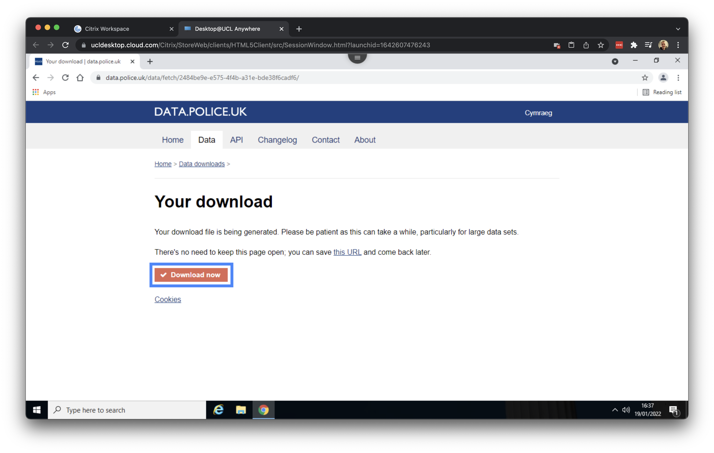

--- 
title: "Geography in the Field II: Mapping London"
author: Justin van Dijk
date: "`r Sys.Date()`"
site: bookdown::bookdown_site
output: bookdown::gitbook
documentclass: book
link-citations: yes
github-repo: "jtvandijk/GEOG0014"
description: "GEOG0014: Geography in the Field II."
url: 'https\://jtvandijk.github.io/GEOG0014/'
---

#  {-}

## Why London? {-}
It is an exciting time to be a quantitative geographer in London. The city is generating more data for us to work with than ever before. Maps, graphics and infographics about the city are everywhere more people live here than at any time in London’s history. A great example of the variety of data that is available for London is captured in the book [London: The Information Capital] by [James Cheshire](https://jcheshire.com/) and [Oliver Uberti](https://www.oliveruberti.com/the-information-capital). As geographers, we are in a critical position both to be able to capitalise on these developments for our own research but also view them a little more critically than others who have not had the benefit of decades of social and spatial research.

```{r london-information-capital, echo=FALSE, fig.align='center', out.width='500pt', fig.cap='London: The Information Capital by Professor [James Cheshire](https://jcheshire.com/) and [Oliver Uberti](https://www.oliveruberti.com/the-information-capital).'}
knitr::include_graphics('images/w08/information_capital.png')
```

The application of quantitative research methods to data about the "real-world" is at the heart of this exercise. All data are collected at a single point in time and so may become out of date, or they may be too generalised to capture the minutiae of an area. Such limitations are not as significant as they once were since we now have access to data in more detail than ever before, but this does not relinquish the need to get a sense for the broader context of the study area. 

## This week {-}
This week we will be mapping **crime hotspots** in the London boroughs of [Camden](https://www.google.com/maps/place/London+Borough+of+Camden,+London/@51.5428102,-0.1944449,13z/data=!3m1!4b1!4m5!3m4!1s0x48761aec186b9a3d:0x41185c626be66e0!8m2!3d51.5454736!4d-0.1627902?hl=en) and [Islington](https://www.google.com/maps/place/London+Borough+of+Islington,+London/@51.5470193,-0.1444663,13z/data=!3m1!4b1!4m5!3m4!1s0x48761b5dedeb3be5:0x54f085cb18ec65c9!8m2!3d51.5465063!4d-0.1058058?hl=en). The data we will be working with for this week's task are downloaded from the [data.police.uk](https://data.police.uk/) website. The release of official police crime data to the public was controversial at the time, with some people expressing concern that areas will have reputational damage, that the identities of victims would be revealed and that there would be social and economic consequences such as a fall in house prices in high crime areas. Others argued that the release of the data would be an important step in making the police force more accountable since the public could track whether crimes were being solved or if police are using their stop and search powers to target specific groups. 

:::note
**Note** <br />
You are expected to work through the following computer tutorial on your own, however, you need to submit your worksheet for this week as a group.
:::

## Getting started {-}
Some of you may already have played around with some GIS software such as [ArcGIS](https://www.arcgis.com/index.html), but today we will be using the open-source GIS sofware suite [QGIS](https://www.qgis.org/en/site/). A copy of [QGIS](https://www.qgis.org/en/site/) comes pre-installed on all cluster room computers as well as on [Desktop@UCL Anywhere](https://www.ucl.ac.uk/isd/services/computers/remote-access/desktopucl-anywhere). Desktop@UCL Anywhere is a service that allows remote access to UCL resources for staff and students. All you need is a valid UCL user ID and password, an internet connection and supported web browser. Today we will be using this Desktop@UCL Anywhere service. 

Let's get started by opening an internet browser such as [Google Chrome](https://www.google.co.uk/chrome/?brand=FHFK&gclid=Cj0KCQiAip-PBhDVARIsAPP2xc26lB3ONziz2KnCd7Ac1MVjTx66n0Ull4R8oiQqzXzgKnJSqRCwK60aAhmFEALw_wcB&gclsrc=aw.ds) or [Microsoft Edge](https://www.microsoft.com/en-us/edge) and navigating to: [https://ucldesktop.cloud.com](https://ucldesktop.cloud.com).

```{r ucl-desktop-login, echo=FALSE, fig.align='center', out.width='850pt', fig.cap='[Desktop@UCL Anywhere]((https://ucldesktop.cloud.com)) login interface. [[Enlarge image]](https://jtvandijk.github.io/GEOG0014/images/w08/ucl_login.png){target="_blank"}'}
knitr::include_graphics('images/w08/ucl_login.png')
```

You can log in with your normal **UCL username** and **UCL password**. After this, you click on the Desktop@UCL Anywhere icon to start the service:

```{r ucl-desktop-start, echo=FALSE, fig.align='center', out.width='850pt', fig.cap='Starting [Desktop@UCL Anywhere]((https://ucldesktop.cloud.com)). [[Enlarge image]](https://jtvandijk.github.io/GEOG0014/images/w08/ucl_start.png){target="_blank"}'}
knitr::include_graphics('images/w08/ucl_start.png')
```

It may take a few minutes to load, but after this you should see your normal UCL Windows desktop:

```{r ucl-desktop-login-success, echo=FALSE, fig.align='center', out.width='850pt', fig.cap='Your [Desktop@UCL Anywhere]((https://ucldesktop.cloud.com)). [[Enlarge image]](https://jtvandijk.github.io/GEOG0014/images/w08/ucl_login_success.png){target="_blank"}'}

```

## Downloading crime data {-}
For our crime data, we will use data directly from the Police Data Portal, which you can find at [data.police.uk](https://data.police.uk/). This Data Portal allows you to access and generate tabular data for crime recorded in the U.K. across different the different police forces.

In total, there are 45 territorial police forces (TPF) and 3 special police forces (SPF) of the United Kingdom. Each TPF covers a specific area in the UK (e.g. the "West Midlands Police Force"), whilst the SPFs are cross-jurisdiction and cover specific types of crime, such as the British Transport Police. Therefore, when we want to download data for a specific area, we need to know which Police Force covers the Area of Interest (AOI) for our investigation.

When you look to download crime data for London, for example, there are two territorial police forces working within the city and its greater metropolitan area:

- *The Metropolitan Police Force*, which covers nearly the entire London area, including Greater London
- *The City of London Police*, which covers the City of London. The Met has no jurisdiction in the Cit of London.

Today we will leave the City of London for what it is as we are looking at **crime hotspots** in the London boroughs of [Camden](https://www.google.com/maps/place/London+Borough+of+Camden,+London/@51.5428102,-0.1944449,13z/data=!3m1!4b1!4m5!3m4!1s0x48761aec186b9a3d:0x41185c626be66e0!8m2!3d51.5454736!4d-0.1627902?hl=en) and [Islington](https://www.google.com/maps/place/London+Borough+of+Islington,+London/@51.5470193,-0.1444663,13z/data=!3m1!4b1!4m5!3m4!1s0x48761b5dedeb3be5:0x54f085cb18ec65c9!8m2!3d51.5465063!4d-0.1058058?hl=en), both of which are not part of the City of London. To do this, open a browser (**within** your Desktop@UCL environment) and navigate to [data.police.uk](https://data.police.uk/).

```{r data-police, echo=FALSE, fig.align='center', out.width='850pt', fig.cap='The landing page of [data.police.uk](https://data.police.uk). [[Enlarge image]](https://jtvandijk.github.io/GEOG0014/images/w08/data_police.png){target="_blank"}'}
knitr::include_graphics('images/w08/data_police.png')
```

Click on **Downloads** and subsequently select *November 2021* to *November 2021* as data range and tick the box for the *Metropolitan Police Services*. With this selection we can now download all crime data recorded by the Metropolitan Police Services for the month of November 2021.

```{r data-police-select, echo=FALSE, fig.align='center', out.width='850pt', fig.cap='Select the data that we want to download. [[Enlarge image]](https://jtvandijk.github.io/GEOG0014/images/w08/select_data.png){target="_blank"}'}
knitr::include_graphics('images/w08/select_data.png')
```

Make sure that the box in front of **Include crime data** is ticked - it should be ticked by default - and proceed to click on **Generate file**. Once your file is generated you can click on **Download now**.

```{r data-police-download, echo=FALSE, fig.align='center', out.width='850pt', fig.cap='Download the data. [[Enlarge image]](https://jtvandijk.github.io/GEOG0014/images/w08/download_now.png){target="_blank"}'}

```

Save the file as `crime_met_november2021` in your `Downloads` folder.

```{r data-police-save, echo=FALSE, fig.align='center', out.width='850pt', fig.cap='Save the data. [[Enlarge image]](https://jtvandijk.github.io/GEOG0014/images/w08/save_now.png){target="_blank"}'}
knitr::include_graphics('images/w08/save_now.png')
```

## Mapping crime data {-}

## Worksheet {-}
Now you have worked through the steps in the computer tutorial on [downloading](#downloading-crime-data) and [mapping](#mapping-crime-data) crime data, you should do the following:

:::note
**Note** <br />
You should be conducting the below steps together with your group members. You can only submit one worksheet per group.
:::

1.	Using what you have learnt in the computer tutorial create two heat maps for **Camden and Islington**. The first of **anti-social behaviour** and the second of **bicycle theft**.
2.	There are a number of crime **hot spots** for **anti-social behaviour** and **bicycle theft** that appear near UCL (particularly around Kings Cross Station). Using [Google Streetview](https://www.google.com/maps/place/Kings+Cross+Station/@51.531233,-0.1265839,17z/data=!3m1!4b1!4m5!3m4!1s0x48761ba3a5a1470b:0xd5656d630ccedd8c!8m2!3d51.531233!4d-0.1243952) for context, what features distinguish them from their surrounding lower crime areas? 
4.	Using the data, zoom in on the street you have been allocated. What is the dominant type of crime on this street and its surrounding area in **December*?
5.	Revisit the [data.police.uk](https://data.police.uk/) website and create a heatmap for crime around your street in **July 2021** and **December 2021**. As there may be very few or no crimes in your allocated street, you can zoom out a little to incorporate surrounding streets. Do the patterns and dominant crime types differ over the course of the year?
6.	Given your knowledge of your street and your observations of the crime hotspots around UCL and Kings Cross what other datasets might be useful to analyse crime in London?
7.	Do you think the chances of falling victim of crime are higher or lower in the crime hotspots, how might you measure this? 

## Submission {-}
Please submit your answers to the questions above in a short **group** report: no more than **500** words, a maximum of **4** maps, and **2** photographs. This is the worksheet task for the week. You can find the submission link for this final worksheet task on [Moodle](https://moodle.ucl.ac.uk/course/view.php?id=23839); one submission per group. [That is it for this week's Geography in the Field!](https://www.youtube.com/watch?v=h_D3VFfhvs4)

<!--chapter:end:index.Rmd-->

